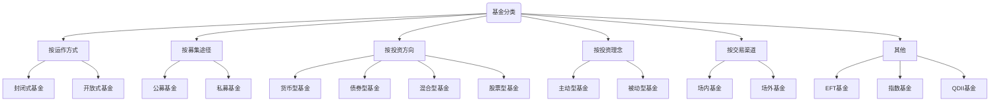

#### **1.基金分类：**

#### **2.基金常识**

######  **基金交易时间：交易日的AM 9:30 - 11:30 ,PM 1:00 - 3:00， 3点前买入按当日结束后的净值计算份额，3点后买入按次日结束后净值计算份额**

######  **基金单位净值：基金总净资产与基金份额的比值**

######  **七日年化收益率：是基金过去七天每万份基金份额净收益折合成的年收益率，7日年化收益率是个短期指标，不可能反应一年的实际收益，只能作**         

######  **为一个参考。（第七天结束后的价值 - 第一天的开始前的价值- 7天的费用)/第一天开始前的价值/7 x 365 x 100%**

######  **基金交易费指的是进行基金交易产生的费用**

######  **认购费：募集期内购买基金份额就需要缴纳认购费。认购费 = 认购金额 x 认购费率 ，  认购费率通常在1%左右**

######  **申购费率：投资者买入基金是的费用比率。申购费：基金存续期间买入基金需要支付的手续费， 申购费 = 申购金额 x 申购费率，** 

######  **赎回费率：投资者卖出基金是的费用比率。 赎回费：卖出基金份额时需要支付的费用。赎回费计入基金资产，目的鼓励长期持有**

######  **转换费：基金转换时的需要支付的费用。**

######  **基金管理费：帮你管理这个基金收取的佣金，  1.5%一年**

######  **托管费：资金托管在银行提供的费用，   0.25%一年**

######  **基金分红：基金公司获取投资收益，然后将部分收益以现金形式派发给基民。**

###### **后缀字母不同代表不同的收费方式，A：前端申购 ，买入收费 B：后端申购 ，卖出收费  C：无论买卖都不收费，但收销售服务费**

######  **清盘：指把基金资产全部变现，然后分给持有人的行为。 清盘前提：基金净值连续60天未达到要求，且持有人少于1000人，**

######  **波动率：反应金融资产波动程度的指标，波动率高，资产收益率难以确定，波动率低，资产价格波动平缓，资产收益相对稳定**

######  **最大回撤率：指基金在某个时间段内最高净值与最低净值的差。回撤率越小，风险相对就越小**

######  **收益回撤比： 资产收益率/ 资金回撤率 。收益回撤比越大说明收益能力越强，最大回撤越小**

######  **夏普比率：表示每承担一单位风险，预期可以拿到多少超额收益。指标越大风险回报越高，夏普比率越大则基金性价比越高**

###### **大盘：上证指数，其样本股是在上海证券交易所全部上市股票**

###### **沪深300指数：从上交所和深交所挑选规模最大，流动性最好的300只股票。国内股市最具代表性的指数**

###### **贝塔系数：是一个相对指标，数值的大小反应基金业绩跟大盘之间的关联度，系数以1为分界线，系数越高，意味着基金业绩和大盘的联动就越高。指数基金那贝塔应该等于1，如果贝塔大于1，那代表，当大盘上涨，他涨的更猛，大盘下跌，他跌的也越狠。**

###### **阿尔法：代表基金能多大程度跑赢大盘。是每一只主动基金追求的额外收益，你可以理解为跑赢同类指数的能力，阿尔法越大，说明她的额外收益越高，阿尔法收益主要取决于基金经理的主动管理能力，对基金经理的选股和择时能力要求比较高**

######  **ETF基金：交易型开放指数基金，通常又称为“交易所交交易基金”，是一种在交易所上市交易的、基金份额可变的一种开放式基金。**

###### **LOF基金：上市开放基金，是一种既可以在场内（交易所）交易，又可以在场外交易的基金**

###### **FOF：基中基，买其他的基金**

###### **宽基指数：宽基指数对应的基金成分股包含多个行业**

###### **行业指数： 行业指数所对应的基金也必须要包含十只以上的成份股，且是同一行业。**

######**北向资金：沪港通中，港股投资者购买内地股票，是目前外资的主要输入途径。** 

######**南向资金：南下资金：沪港通中，内地投资者购买香港股票** 

###### **A股：人民币普通股票，即由中国注册公司发行，在境内上市，以人民币标明面值，供境内个人和机构以人民币交易和认购的股票。**

###### **蓝筹股：经营业绩较好，具有稳定且较高的现金股利支付的公司股票称为蓝筹股**

###### **白马股： 长期绩优、回报率高并具有较高投资价值的股票。特点是高成长、低风险、数量少，如贵州茅台。**

###### **牛市：多头市场，股市价格的总趋势是不断走高，特征是大涨小跌。买入者多于卖出者，新资金不断涌入，供大于求。牛市买券商**

###### **熊市： 空头市场，股市价格的总趋势是不断走低，特征是大跌小涨。中国股市没有做空机制，所以绝大多数人熊市会深陷亏损，要避免盲目抄底**

###### **涨停板：股价短时间上涨速度过快，国内涨幅达10%时，强行停止交易。**

###### **跌停板：股价短时间内下跌过猛，国内跌幅达-10%时，强行停止交易。**

###### **跳水：股票表现为短时间内迅速下跌，k线呈现出直线下降的形态。**

#### **基金术语**

######  **建仓：1.基金募集结束后的封闭期内，基金经理的买入行为。2.基民没有持仓的申购行为**

######  **补仓：二次买入的操作，基金净值下跌，在相对低位买入，以此摊平持有成本**

######  **加码：基金净值不断上涨，为了扩大收益，再次买入**

###### **持仓：投资者买入基金份额后一直持有不动的过程**

######  **满仓：All in**

######  **做多：是指投资者看好后市**

######  **逼空：基金净值短时内不断升高，让一些原本希望在基金净值跌下来的在买入的投资者没有机会进场，不得已高位买入**

######  **踏空：基金净值一直出入投资者心理价位之上，只能空仓等待，以致错失行情**

###### **止盈：涨了就卖**

###### **止损：亏了就卖，防止亏更多**

###### **追涨：基金一直涨，趁机买入**

###### **杀跌：基金跌太多，吓的就卖了**

###### 

#### **如何分析基金**

######  **1.基金公司的业绩表现**

###### **2.优秀的投资团队**

###### **3.基金公司的形象和信誉**

######  **4.基金公司的投资风格和专长**

######  **5.基金规模，5-50亿最佳，太小，管理费高，不稳定不安全，太大笨拙，调仓难度高**

###### **6.基金基本面业绩表现，持仓股**

######  **7.申购费，赎回费，托管费，手续费， 降低交易成本，提高收益**

##### **购买基金的目的： 抵御通货膨胀，使资产保值**

#### **最常用的估值指标有哪些呢？主要是 4 个：市盈率、盈利收益率、市净率、股息率。**

###### 市盈率：公司市值/公司盈利 即PE=P/E 。 反映了我们愿意为获取 1 元的净利润付出多少代价。市值代表我们买下这个公司理论上需要的资金量

###### 盈利收益率：公司盈利/公司市值，盈利收益率PE=E/P 。 假如我们把一家公司全部买下来，这家公司一年的盈利能够带给我们的收益率，

###### 企业资产运作效率ROE ：净资产收益率ROE=净利润/净资产。 

###### ROE 越高的企业，资产运作效率越高，市净率也就越高

###### 市净率PB=P/B 公司市值/公司净资产

###### 股息率=现金分红(股息)/公司市值

###### 资产负债率=总负债/总资产

###### 分红率=现金派息额(股息)/总净利润

