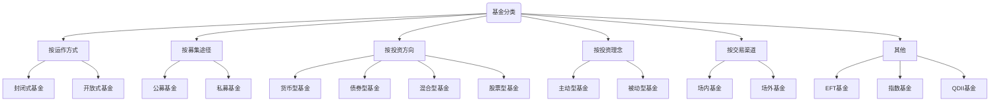

#### 1.基金分类：

#### 基金术语

###### 建仓：1.基金募集结束后的封闭期内，基金经理的买入行为。2.基民没有持仓的申购行为

###### 补仓：二次买入的操作，基金净值下跌，在相对低位买入，以此摊平持有成本

###### 加码：基金净值不断上涨，为了扩大收益，再次买入

######持仓：投资者买入基金份额后一直持有不动的过程

###### 满仓：All in

###### 做多：是指投资者看好后市

###### 逼空：基金净值短时内不断升高，让一些原本希望在基金净值跌下来的在买入的投资者没有机会进场，不得已高位买入

###### 踏空：基金净值一直出入投资者心理价位之上，只能空仓等待，以致错失行情

###### 基金交易时间：交易日的AM 9:30 - 11:30 ,PM 1:00 - 3:00， 3点前买入按当日结束后的净值计算份额，3点后买入按次日结束后净值计算份额

###### 基金单位净值：基金总净资产与基金份额的比值

###### 七日年化收益率：是基金过去七天每万份基金份额净收益折合成的年收益率，7日年化收益率是个短期指标，不可能反应一年的实际收益，只能作为一个参考。（第七天结束后的价值 - 第一天的开始前的价值- 7天的费用)/第一天开始前的价值/7 x 365 x 100%

###### 基金交易费指的是进行基金交易产生的费用

###### 认购费：募集期内购买基金份额就需要缴纳认购费。认购费 = 认购金额 x 认购费率 ，  认购费率通常在1%左右

###### 申购费率：投资者买入基金是的费用比率。申购费：基金存续期间买入基金需要支付的手续费， 申购费 = 申购金额 x 申购费率， 

###### 赎回费率：投资者卖出基金是的费用比率。 赎回费：卖出基金份额时需要支付的费用。赎回费计入基金资产，目的鼓励长期持有

###### 转换费：同一基金平台不同基金间转换产生的费用

###### 基金管理费：基金经理帮助基民投资收取的劳动报酬，  1.5%一年

###### 托管费：资金托管在银行提供的服务费，   0.25%一年

###### 基金分红：基金公司获取投资收益，然后将部分收益以现金形式派发给基民。

######后缀字母不同代表不同的收费方式，A：前端申购 ，买入收费 B：后端申购 ，卖出收费  C：无论买卖都不收费，但收销售服务费

###### 清盘：指把基金资产全部变现，然后分给持有人的行为。 清盘前提：基金净值连续60天未达到要求，且持有人少于1000人，

###### 波动率：反应金融资产波动程度的指标，波动率高，资产收益率难以确定，波动率低，资产价格波动平缓，资产收益相对稳定

###### 最大回撤率：指基金在某个时间段内最高净值与最低净值的差。回撤率越小，风险相对就越小

###### 收益回撤比： 资产收益率/ 资金回撤率 。收益回撤比越大说明收益能力越强，最大回撤越小

###### 夏普比率：表示每承担一单位风险，预期可以拿到多少超额收益。指标越大越好，夏普比率越大则基金性价比越高

#####购买基金的目的： 抵御通货膨胀，使资产保值

#### 选基金标准

###### 1.基金公司的业绩表现

######2.优秀的投资团队

######3.基金公司的形象和信誉

###### 4.基金公司的投资风格和专长

###### 5.基金规模

###### 6.申购费，赎回费，托管费，手续费

